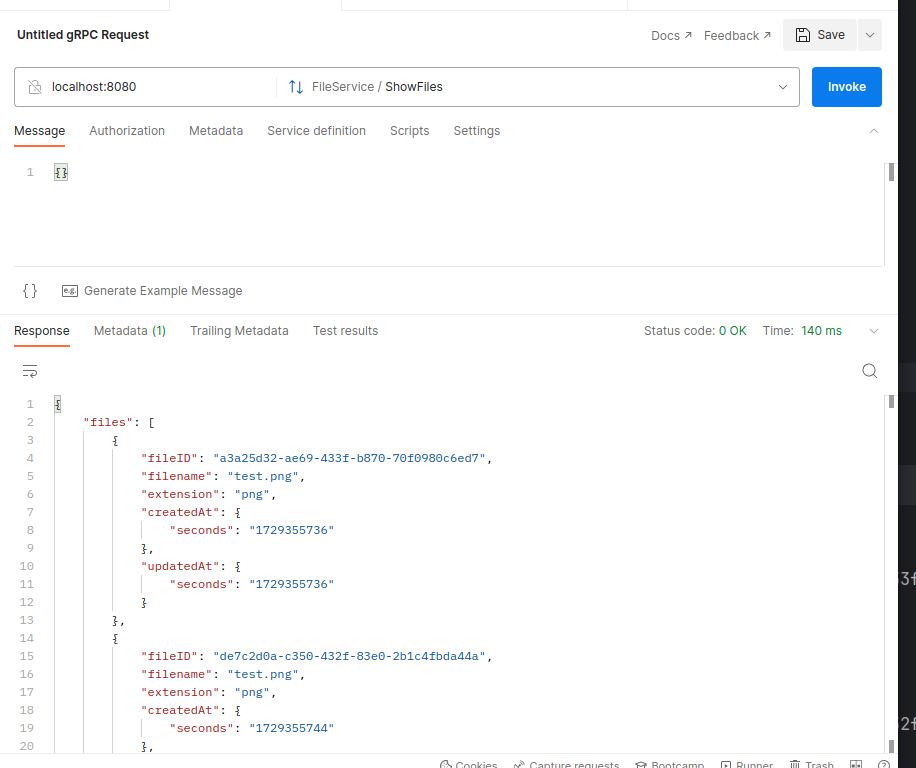

## Usage

Before running - create all necessary folders:
```shell
task -d scripts folders -v
```

Launch server:
```shell
task -d scripts server -v
```

Launch client, to test uploading and downloading files:
```shell
task -d scripts client -v
```

To check available for download files - use ShowFiles gRPC method using Postman:


## Linters

```shell
 task -d scripts linters -v
```
